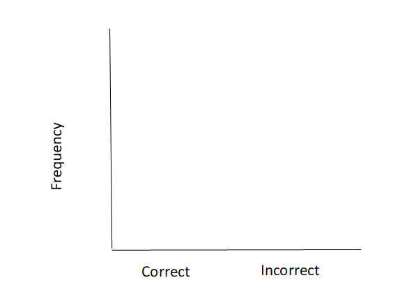
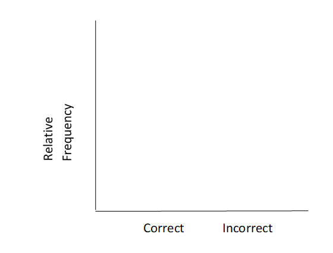

---
output:
  pdf_document: default
  html_document: default
---
# Martian Alphabet

```{r setup, include=FALSE}
knitr::opts_chunk$set(echo = FALSE)
options(show.signif.stars = FALSE)
```

## Learning outcomes

* Describe the statistical investigation process

* Identify observational units, variables, and variable types in a statistical study

## Terminology review
Statistics is the study of how best to collect, analyze, and draw conclusions from data.  Today in class you will be introduced to the following terms:

* Observational units or cases

* Variables: categorical or quantitative 

* Proportions

* Graphs: frequency bar plot and relative frequency bar plot

* Distribution

For more on these concepts, read Sections 1.2 and 2.1 in the textbook.

## Can you read "Martian"?

How well can humans distinguish one “Martian” letter from another? In today’s activity, we’ll find out. When shown the two Martian letters, Kiki and Bumba, write down whether you think Bumba is on the left or on the right.
\vspace{2mm}

1.	Were you correct or incorrect in identifying Bumba?

\vspace{0.3in}

### Steps of the statistical investigation process {-}

**Step 1**: The first step of any statistical investigation is to *ask a research question*.  In this study the research question is: can we as a class read Martian? (We will refine this later on!).

**Step 2**: To answer any research question, we must *design a study and collect data*. For our question, the study consists of each student being presented with two Martian letters and asking which was Bumba.  Your responses will become our observed data that we will explore.  

\newpage
**Observational units** or **cases** are the subjects data are collected on. In a spreadsheet of the data set, each row will represent a single observational unit.  

2.  What are the observational units in this study?

\vspace{0.4in}

3.  How many students are in class today? This is the *sample size*.

\vspace{0.3in}

A **variable** is information collected or measured on each observational unit or case. Each column in a data set will represent a different variable. Today we are only measuring one variable on each observational unit.

4. Identify the variable we are collecting on each observational unit in this study, i.e., what are we measuring on each student?  *Hint*: Your answer to question 1 is the outcome for the variable measured on one observational unit.

\vspace{.8in}


We will look at two types of variables: **quantitative** and **categorical** (see Figure \@ref(fig:types-of-variables)). 

Quantitative variables are numerical measurements that can be discrete (whole, non-negative numbers) or continuous (any value within an interval).  The number of pets one owns would be a discrete variable as you can not have a partial pet.  GPA would be a continuous variable ranging from 0 to 4.0. 

Categorical variables are data that are in groups or categories such as eye color, state of residency, or whether or not a student lives on campus. Categorical variables with a natural ordering are considered ordinal variables while those without a natural ordering are considered nominal variables.  All categorical variables will be treated as nominal for analysis in this course.

```{r types-of-variables, fig.align = "center", out.width="60%", fig.cap="Types of variables."}
include_graphics("images/variables.png")
```

5. Is the variable identified in question 4 categorical or quantitative?

\vspace{0.3in}

\newpage
**Step 3**: Once we have collected data, the next step is to *summarize and visualize the data*.

6.	How many people in your class were correct in identifying Bumba?  Using the class size from question 2, calculate the proportion of students who correctly identified Bumba.  

\begin{center}
$\mbox{proportion} = \frac{\mbox{number of students who correctly identified Bumba}}{\mbox{total number of students}}$
\end{center}

\vspace{0.7in}

The proportion in question 6 is called a **summary statistic**---a single value that summarizes the data set. It is important to note that a variable is different than a summary statistic. A *variable* is measured on a *single observational unit* while a summary statistic is calculated from a group of observational units.  For example, the variable "whether or not a student lives on campus" can be measured on each individual student.  In a class of 50 students we can calculate the proportion of students who live on campus, the summary statistic.  Look back and make sure you wrote the variable in question 3 as a variable, NOT a summary statistic. 


Looking at the data set and the summary statistic is only one way to display the data.  We will also want to create a visualization or picture of the data. A **frequency bar plot** is used to display categorical data as a count or frequency. Since our variable has two levels or outcomes, correct or incorrect, we will create two bars---one for each level.

7. Plot the observed class data using a frequency bar plot. Be sure to add a scale to the y-axis.

```{r, fig.align = "center", out.width="40%"}

```

We can also visualize the data as a proportion in a **relative frequency bar plot**.  Relative frequency is the proportion calculated for each level of the categorical variable. 


8. Plot the observed class data using a relative frequency bar plot. Be sure to add a scale to the y-axis.

```{r, fig.align = "center", out.width="40%"}

```

\newpage                    
**Step 4**: The next step is to *use statistical analysis methods to draw inferences from the data*. To answer the research question, we will simulate what *could* have happened in our class given random chance, repeat many times to understand the expected *variability* between different "randomly guessing" classes, then compare our class's observed data to the simulation.  This gives us an estimate of how often (or the probability of) the class's result would occur if students were all merely guessing, allowing us to determine if the data provides evidence that we as a class can in fact read Martian.

9. If humans really don’t know Martian and are just guessing which is Bumba, what are the chances of getting it right?
\vspace{0.3in}

    How could we use a coin to simulate each student “just guessing” which Martian letter is Bumba?
\vspace{.9in}

    How could we use coins to simulate the entire class “just guessing” which Martian letter is Bumba? 
\vspace{.9in}

    How many people in your class would you expect to choose Bumba correctly just by chance?  Explain your reasoning.
\vspace{.9in}

10. Each student will flip a coin one time to simulate your “guess”.  Let Heads = correct, Tails = incorrect.  What was the result of your one simulation?
\vspace{.3in}

    What was the result from your class’s simulation?  What proportion of students “guessed” correctly in the simulation?
\vspace{.3in}

11. If students really don’t know Martian and are just guessing which is Bumba, which seems more unusual: the result from your class’s **simulation** or the observed proportion of students in your class that were correct (this is your summary statistic from question 6)?  Explain your reasoning.

\newpage

12.	While your observed class data is likely far different from the simulated “just-guessing” class, comparing our class data to a single simulation does not give enough information.  The differences seen could just be due to that set of coin flips!  Let’s simulate another class.  Each student should flip their coin again.  What was the result from your class’s second simulation?  What proportion of students “guessed” correctly in the second simulation?  Create a plot to compare the two simulated results with the observed class result.

\vspace{1in}


13.	We still only have a couple of simulations to compare our class data to.  It would be much better to be able to see how our class compared to hundreds or thousands of “just-guessing” classes.  Since we don’t want to flip coins all class period, your instructor will use a computer simulation to get 1000 trials. Fill in the following blanks to describe how we would create a simulation of random guessing with 1000 trials (repetitions).

|           Probability of correct guesses: _____
\vspace{0.05in}
    
|           Sample size: _____
\vspace{0.05in}

|           Number of repetitions: _____
\vspace{0.05in}

14.  Sketch the distribution displayed by your instructor here.  Label each axis appropriately. 

\vspace{1.5in}

15. Is your class particularly good or bad at Martian?  Use the plot in question 14 to explain your answer. 

\vspace{.5in}

16.	Is it *possible* that we could see our class results just by chance if everyone was just guessing?  Explain your reasoning.

\vspace{.5in}

17.	Is it *likely* that we could see our class results just by chance if everyone was just guessing?  Explain your reasoning.

\vspace{.5in}

**Step 5**: The next step in the statistical investigation process is to *communicate the results and answer the research question*.

18.	Does this activity provide strong evidence that students were not just guessing at random? If so, what do you think is going on here?  Can we as a class read Martian?^[Reference for “Martian alphabet” is a TED talk given by Vilayanur Ramachandran in 2007. The synesthesia part begins at roughly 17:30 minutes: `http://www.ted.com/talks/vilayanur_ramachandran_on_your_mind`.]  

\vspace{1in}

**Step 6**: The final step of any statistical investigation is to *revisit and look ahead*. 

19. Can you think of any limitations of our study?  Can you think of a new topic that might be of interest based on the results of our study?

\vspace{1in}


## Take home messages

1.	In this course we will learn how to evaluate a claim by comparing observed results (classes’ "guesses" when asked to identify Bumba) to a distribution of many simulated results under an assumption like “blind guessing.”

2.	Blind guessing between two outcomes will be correct only about half the time. We can simulate data using a computer program to fit the assumption of blind guessing.

3.	Unusual observed results will make us doubt the assumptions used to create the simulated distribution. A large number of correct “guesses” is evidence that a person was not just blindly guessing.

\newpage

## Out of Class Activity

Since this class is taught in a blended format we are only in class one day per week.  During class we will complete the in-class activity from the course pack.  Outside of class, students will read from the textbook, watch course videos, and complete an out-of-class activity on the other two days of class.  To become familiar with the course outline, read through the syllabus, https://mtstateintrostats.github.io/Syllabus/, the day specific cohort calendar, and watch the Stat 216 Course Tour on D2L before answering the following questions.

1. When are the case study discussion posts due?

\vspace{0.3in}

2.  For your cohort, what day and time are the weekly assignments due on Gradescope?

\vspace{0.3in}

3.  For your cohort, when is Exam 1? Exam 2?

\vspace{0.3in}

In Stat 216 we will use the statistical package `R` to analyze data.  Read through the instructions on the syllabus and download `R` and `RStudio Desktop` to your computer.  If you have a Chromebook or have problems installing `R` and `RStudio Desktop` on your machine, you will need to use `RStudio Cloud` or an MSU virtual machine.  Read through the preliminaries chapter in the textbook and watch the video `RStudio_GettingStarted` on D2L -> Content -> Primary Resources before completing the following questions.

Open `RStudio` on your computer.  Download the Martian Alphabet `RScript` file from D2L and open in `RStudio`.  If the file does not open directly, open manually:

* In `RStudio` click on File in the upper left hand corner, choose Open File, find the downloaded file.
 
If you are using `RStudioCloud` watch the video `RStudioCloud_GettingStarted` on D2L -> Content -> Primary Resources to learn how to open the file in `RStudioCloud`.

In the Martian Alphabet `Rscript` file, highlight the first 14 lines of code and click run. This will install the packages needed for this course.  We review a few of these packages here. 

Throughout the semester we will use the package `tidyverse` to allow us to use chaining (see Section 1.7 in the textbook for more on this symbol %>%.)  We will use the package `ggplot2` to create graphs in `RStudio`, the package `mosaic` to use the favstats function to find summary statistics for quantitative variables, and the package `catstats` starting in Chapter 5 to create simulations.  Once you have installed these packages you will only need to use the library function to call each package to use.

The \# sign is not part of the `R` code. 
It is used by these authors to add comments to the `R` code and explain what each call is telling the program to do.
`R` will ignore everything after a \# sign when executing the code.

In the Martian Alphabet `RScript` file for the one proportion test, enter your class size (Q3 from the in-class activity) for sample_size and the number of students who were correct in identifying Bumba (Q6 from the in-class activity) for as_extreme_as in the one_proportion_test.  Highlight lines 16 - 21 and click run.

4.  Is the distribution created from this code similar to what you saw in class in Q14?

\vspace{0.3in}

## Additional notes

Use this space to summarize your thoughts and take additional notes on this week's activity and material covered, and to write down the names and contact information of your teammates.
