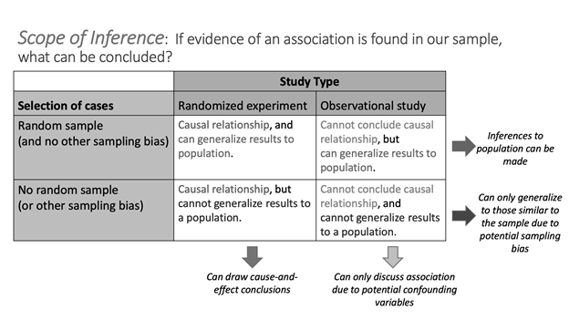

## Module 2 Lab: Study Design

\setstretch{1}

### Learning outcomes

* Explain the purpose of random assignment and its effect on scope of inference.

* Identify whether a study design is observational or an experiment.

* Identify confounding variables in observational studies and explain why they are confounding.

### Terminology review

In this activity, we will examine different study designs, confounding variables, and how to determine the scope of inference for a study. Some terms covered in this activity are:

* Scope of inference

* Explanatory variable

* Response variable

* Confounding variable

* Experiment

* Observational study

To review these concepts, see Sections 2.2 through 2.5 in the textbook.  

### General information labs

Remember at the end of each module you will complete a lab. Questions are selected from each lab to be turned in on Gradescope.  The questions to be submitted on Gradescope are bolded in the lab.  As you work through the lab have the Gradescope lab assignment open so that you can answer those questions as you go.

### Atrial fibrillation 

Atrial fibrillation is an irregular and often elevated heart rate. In some people, atrial fibrillation will come and go on its own, but others will experience this condition on a permanent basis.  When atrial fibrillation is constant, medications are required to stabilize the patient's heart rate and to help prevent blood clots from forming.  Pharmaceutical scientists at a large pharmaceutical company believe they have developed a new medication that effectively stabilizes heart rates in people with permanent atrial fibrillation.  They set out to conduct a trial study to investigate the new drug.  The scientists will need to compare the proportion of patients whose heart rate is stabilized between two groups of subjects, one of whom is given a placebo and the other given the new medication. 

1. Identify the explanatory and response variable in this trial study.

    Explanatory variable:
\vspace{0.5in}

    Response variable:
\vspace{0.5in}

\newpage

Suppose 24 subjects with permanent atrial fibrillation have volunteered to participate in this study. There are 16 subjects that self-identified as male and 8 subjects that self-identified as female.

2. One way to separate into two groups would be give all the males the placebo and all the females the new drug.  Explain why this is not a reasonable strategy.
\vspace{1in}

3. Could the scientists fix the problem with the strategy presented in question 2 by creating equal sized groups by putting 4 males and 8 females into the drug group and the remaining 12 males in the placebo group?  Explain your answer.
\vspace{0.5in}

4. A third strategy would be to **block** on sex.  In this type of study, the scientists would assign 4 females and 8 males to each group.   Using this strategy, what **proportion** of males out of the 12 individuals would be in each group?
\vspace{0.3in}

5. **Assume the scientists used the strategy in question 4, but they put the four tallest females and eight tallest males into the drug group and the remaining subjects into the placebo group. They found that the proportion of patients whose heart rate stabilized is higher in the drug group than the placebo group.**  
\vspace{0.1in}

    Could that difference be due to the sex of the subjects?  Explain your answer.
\vspace{0.5in}

    Could it be due to other variables?  Explain your answer.
\vspace{0.5in}

While the strategy presented in question 5 controlled for the sex of the subject, there are more potential **confounding variables** in the study.  A confounding variable is a variable that is _both_

1. associated with the explanatory variable, _and_
2. associated with the response variable.

When both these conditions are met, if we observe an association between the explanatory variable and the response variable in the data, we cannot be sure if this association is due to the explanatory variable or the confounding variable---the explanatory and confounding variables are "confounded."

**Random assignment** means that subjects in a study have an equally likely chance of receiving any of the available treatments.

\newpage

6. You will now investigate how randomly assigning subjects impacts a study's scope of inference.  

*  Navigate to the "Randomizing Subjects" applet under the "Other Applets" heading at: http://www.rossmanchance.com/ISIapplets.html.  This applet lists the sex and height of each of the 24 subjects.  Click "Show Graphs" to see a bar chart showing the sex of each subject.  Currently, the applet is showing the strategy outlined in question 3.  

* Click "Randomize".  

|    In this random assignment, what proportion of males are in group 1 (the placebo group)?  
\vspace{0.1in}

|    What proportion of males are in group 2 (the drug group)?  
\vspace{0.1in}

|    What is the difference in proportion of males between the two groups (placebo - drug)?
\vspace{0.1in}

7.  Notice the difference in the two proportions is shown as a dot in the plot at the bottom of the web page.  Un-check the box for Animate above "Randomize" and click "Randomize" again.  Did you get the same difference in proportion of males between the placebo and drug groups?
\vspace{0.25in}

8.  Change "Replications" to 998 (for 1000 total).  Click "Randomize" again. Sketch the plot of the distribution of difference in proportions from each of the 1000 random assignments here.  Be sure to include a descriptive $x$-axis label. 
\vspace{1.25in}

9.  **Does random assignment *always* balance the placebo and drug groups based on the sex of the participants?  Does random assignment *tend* to make the placebo and drug groups *roughly* the same with respect to the distribution of sex?  Use your plot from question 8 to justify your answers.**
\vspace{0.5in}

10. Change the drop-down menu below Group 2 from "sex" to "height".  The applet now calculates the average height in the placebo and drug groups for each of the 1000 random assignments.  The dot plot displays the distribution of the difference in mean heights (placebo - drug) for each random assignment. Based on this dot plot, is height distributed equally, on average, between the two groups?  Explain how you know.
\vspace{0.5in}

\newpage

<!-- 15. Suppose there is a genetic component to how well permanent atrial fibrillation responds to medication.  The scientists do not know about this gene ahead of time, but if you select Reveal gene? under "Choose variables" then change the drop-down menu under Group 2 from "height" to "gene", we can see how random assignment impacts the distribution of this gene between the two groups.  Explain what happens to the gene variable, in the long run, if random assignment is used to create the two groups.  Use the dot plot to justify your answer. -->
<!-- \vspace{0.5in} -->

The diagram below summarizes these ideas about confounding variables and random assignment.  When a confounding variable is present (such as sex or height), and an association is found in a study, it is impossible to discern what caused the change in the response variable.  Is the change the result of the explanatory variable or the confounding variable?  However, if all confounding variables are *balanced* across the treatment groups, then only the explanatory variable differs between the groups and thus *must have caused* the change seen in the response variable.


```{r, out.width="40%"}
par_og <- par(no.readonly = TRUE) # save original par
par(mar = rep(0, 4))
plot(c(-0.05, 1.2),
     c(0.39, 1),
     type = 'n',
     axes = FALSE)
text(0.59, 0.89, 'confounding 
     variable', cex = 1.3)
rect(0.4, 0.8, 0.78, 1)
text(0.3, 0.49, 'explanatory', cex = 1.3)
rect(0.1, 0.4, 0.48, 0.6)
arrows(0.49, 0.78, 0.38, 0.62,
       length = 0.08, lwd = 1.5)
text(0.87, 0.5, 'response', cex = 1.3)
rect(0.71,0.4, 1.01, 0.6)
arrows(0.67, 0.78, 0.8, 0.62,
       length = 0.08, lwd = 1.5)

arrows(0.5, 0.5, 0.69, 0.5,
       length = 0.08)
text(0.595, 0.565, "?",
     cex = 1.5)
par(par_og) # restore original par
```

11.  **What is the purpose of random assignment of the subjects in a study to the explanatory variable groups?**
\vspace{0.8in}

12. Suppose in this study on atrial fibrillation, the scientists did randomly assign groups and found that the drug group has a higher proportion of subjects whose heart rates stabilized than the placebo group.  Can the scientists conclude the new drug *caused* the increased chance of stabilization?  Explain your answer.
\vspace{0.8in}

13. Is the sample of subjects a simple random sample or a convenience sample?

\vspace{0.3in}

14. **Both the sampling method (which we covered last week) and the study design will help to determine the *scope of inference* for a study: To *whom* can we generalize, and can we conclude *causation or only association*? Use your answers to question 12 and 13 and the table on the next page to determine the scope of inference of this trial study described in question 12.**
\vspace{0.3in}

```{r, fig.align = "center", out.width="75%"}

```


### Study design

The two main study designs we will cover are **observational studies** and **experiments**.  In observational studies, researchers have no influence over which subjects are in each group being compared (though they can control other variables in the study).  An experiment is defined by assignment of the treatment groups of the *explanatory variable*, typically via random assignment. 

For the next exercises identify the study design (observational study or experiment), the sampling method, and the scope of inference.

15. The pharmaceutical company Moderna Therapeutics,  working in conjunction with the National Institutes of Health, conducted Phase 3 clinical trials of a vaccine for COVID-19 last fall.  US clinical research sites enrolled 30,000 volunteers without COVID-19 to participate. Participants were randomly assigned to receive either the candidate vaccine or a saline placebo.  They were then followed to assess whether or not they developed COVID-19. The trial was double-blind, so neither the investigators nor the participants knew who was assigned to which group.
\vspace{0.1in}

    Study design:
\vspace{0.3in}

    Sampling method:
\vspace{0.3in}

    Scope of inference:
\newpage

16. **In another study, a local health department randomly selected 1000 US adults without COVID-19 to participate in a health survey.  Each participant was assessed at the beginning of the study and then followed for one year.  They were interested to see which participants elected to receive a vaccination for COVID-19 and whether any participants developed COVID-19.**
\vspace{0.1in}

    Study design:
\vspace{0.3in}

    Sampling method:
\vspace{0.3in}

    Scope of inference:
\vspace{0.3in}

### Take-home messages

1.  The study design (observational study vs, experiment) determines if we can draw causal inferences or not.  If an association is detected, a randomized experiment allows us to conclude that there is a causal (cause-and-effect) relationship between the explanatory and response variable.  Observational studies have potential confounding variables within the study that prevent us from inferring a causal relationship between the variables studied.

2.  Confounding variables are variables not included in the study that are related to both the explanatory and the response variables. When there are potential confounding variables in the study we cannot draw causal inferences. 

3.  Random assignment balances confounding variables across treatment groups.  This eliminates any possible confounding variables by breaking the connections between the explanatory variable and the potential confounding variables.

4.  Observational studies will always carry the possibility of confounding variables.  Randomized experiments, which use random assignment, will have no confounding variables.

### Additional notes

Use this space to summarize your thoughts and take additional notes on today's activity and material covered.

\newpage


