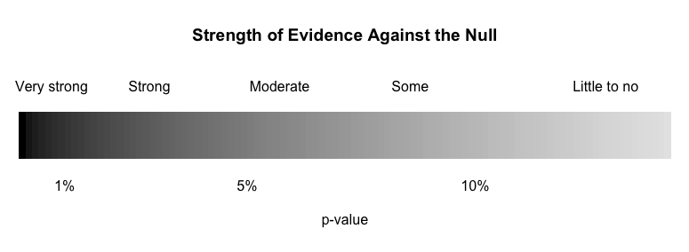

# Inference for a Single Categorical Variable: Hypothesis Testing

## Reading Guide: Categorical Inference

### Section 5.1 (Foundations of inference: Hypothesis tests) {-}

You may skip Section 5.1.4. This section will be covered next week.

**Videos**  

* 5.1

\setstretch{1.25}

#### Vocabulary {-}

Statistical inference: 
\rgs

Hypothesis test: 

\rgi Also called a ‘significance test’.
\rgs

Simulation-based method: 
\rgs

Theory-based method: 
\rgs

Central Limit Theorem:
\rgs

Sampling distribution: 
\rgs

Standard deviation of a statistic: 
\rgs

Standard error of a statistic: 
\rgs

Null hypothesis ($H_0$): 
\rgs

Alternative hypothesis ($H_A$): 
\rgs

P-value: 
\rgs

Point estimate: 
\rgs

Test statistic: 
\rgs

Decision: 
\rgs

Significance level ($\alpha$): 
\rgs 

Statistically significant: 
\rgs

#### Notes {-}

What ‘theory’ is behind the theory-based methods of analysis?
\rgs

Consider the US judicial system:

\rgi What is the null hypothesis?
\rgs

\rgi What is the alternative hypothesis?
\rgs

\rgi The jury is presented with evidence.

|          - If the evidence is strong (beyond a reasonable doubt), the jury will find the defendant: 
\rgs

|          - If the evidence is not strong (not beyond a reasonable doubt), the jury will find the defendant: 
\rgs

To create a simulation, which hypothesis (null or alternative) do we assume is true? 
\rgs

More on p-values: 

\rgi Lower the p-value: 
\rgs

\rgi Interpretations require: 
\rgs

General steps of a hypothesis test:
\rgs

Conclusions should include:
\rgs

Decision:

\rgi If p-value $\leq \alpha$, the decision is to: 

\rgi If p-value $> \alpha$, the decision is to: 

\newpage

True or False: If the p-value is above 0.10, that means the null hypothesis is true.


True or False:  When conducting a simulation-based hypothesis test, the null hypothesis is assumed to be true to create the simulation.
	

#### Formulas {-}

$SD(\hat{p})$ =
\rgs


#### Example: Martian alphabet {-} 

1. What is the sample statistic presented in this example?  What notation would be used to represent this value?
\rgs

2. What are the two possible explanations for how these data could have occurred? 
\rgs


3. Of the two explanations, which is the null and which is the alternative hypothesis?
\rgs


4. How could coins be used to create a simulation of what should happen if everyone in the class was just guessing?
\rgs
\rgs

5. How can we use the simulation to determine which of the two possibilities is more believable?
\rgs
\rgs

6. What decision should be made at an $\alpha = 0.05$ significance level?  Justify your answer.
\rgs

7. Are the results in this example statistically significant?  Justify your answer.
\rgs

### Section 5.2 (The normal distribution) {-}

\setstretch{1}

**Videos**  

* 5.2

\setstretch{1.25}

#### Vocabulary {-}

Normal distribution (Also known as: normal curve, normal model, Gaussian distribution): 
\rgs

\rgi Notation:
\rgs

\newpage

Standard normal distribution: 
\rgs

\rgi Notation:
\rgs

Z-score:
\rgs

$X$th percentile: 
\rgs

68-95-99.7 rule: 
\rgs

#### Notes {-}

Interpretation of a Z-score: 
\rgs

True or False: The more unusual observation will be the observation with the largest Z-score.
	
Approximately what percent of a normal distribution is in the interval

\rgi (mean – standard deviation, mean + standard deviation):
\rgs
 
\rgi (mean – 2$\times$(standard deviation), mean + 2$\times$(standard deviation)):
\rgs

\rgi (mean – 3$\times$(standard deviation), mean + 3$\times$(standard deviation)):
\rgs

#### Formulas {-}

Z =
\rgs

### `R` coding {-}

##### Calculating normal probabilities {-}

When using the `pnorm` `R` function, you will need to enter values for the arguments `mean`, `sd`, and `q` to match the question.

```{r, echo=TRUE, eval=FALSE}
pnorm(mean = mu, sd = sigma, q = x, lower.tail = TRUE)
```

This function will return the proportion of the N(`mu`,`sigma`) distribution which is *below* the value `x`.

Example: `pnorm(mean = 5, sd = 2, q = 3, lower.tail = TRUE)` will give us the proportion of a N(5,2) distribution which is below 3, which equals 0.159:
 
```{r, echo=TRUE, eval=TRUE}
pnorm(mean = 5, sd = 2, q = 3, lower.tail = TRUE)
```

Changing to `lower.tail = FALSE` will give the proportion of the distribution which is *above* the value `x`.

```{r, echo=TRUE, eval=TRUE}
pnorm(mean = 5, sd = 2, q = 3, lower.tail = FALSE)
```

##### Displaying normal probabilities {-} 

When using the `normTail` `R` function, you will need to enter values for the arguments `m`, `s`, and `L` (or `U`) to match the question.

```{r, echo=TRUE, eval=FALSE}
normTail(m = mu, s = sigma, L = x)
```

This function (in the `openintro` package) will plot a N(`mu`, `sigma`) distribution and shade the area that is below the value `x`.

Example: `normTail(m = 5, s = 2, L = 3)` creates the plot pictured below.

```{r normgt3, fig.cap="", out.width="60%", echo=FALSE}
#include_graphics("images/Norm_greaterthan_3.png")
normTail(m = 5, s = 2, L = 3)
```

Changing `L` to `U` will shade the area *above* `x`.  

Example: `normTail(m = 5, s = 2, U = 3)` plots a N(5,2) distribution with the area above 3 shaded.

##### Calculating normal percentiles {-}

When using the `qnorm` `R` function, you will need to enter values for the arguments `mean`, `sd`, and `p` to match the question.

```{r, echo=TRUE, eval=FALSE}
qnorm(mean = mu, sd = sigma, p = x, lower.tail = TRUE)
```

This function will return the value on the N(`mu`, `sigma`) distribution which has `x` area of the distribution *below* it.

Example:  `qnorm(mean = 5, sd = 2, p = 0.159, lower.tail = TRUE)` will give us the value on a N(5,2) distribution which has 0.159 (15.9%) of the distribution below it, which equals 3 (from the `R` output above).

Changing to `lower.tail = FALSE` will give the value which has `x` area of the distribution *above* it.

We would recommend you work through each of the examples in Section 5.2.4 using `R`.


### Section 5.3 (Inference for one proportion) {-}

\setstretch{1}

You may skip Section 5.3.2 and stop before the "Confidence interval for $\pi$" sub-section in Section 5.3.3. These sections will be covered next week.

**Videos**  

* 5.3
* OnePropTheory


\setstretch{1.25}

#### Reminders from previous sections {-}

$n$ = sample size

$\hat{p}$ = sample proportion

$\pi$ = population proportion

General steps of a hypothesis test:

1. Frame the research question in terms of hypotheses.

2. Collect and summarize data using a test statistic.
	
3. Assume the null hypothesis is true, and simulate or mathematically model a null distribution for the test statistic.

4. Compare the observed test statistic to the null distribution to calculate a p-value.

5. Make a conclusion based on the p-value and write the conclusion in context.

Parameter: a value summarizing a variable(s) for a population.

Statistic: a value summarizing a variable(s) for a sample.

Sampling distribution: plot of statistics from 1000s of samples of the same size taken from the same population.

Standard deviation of a statistic: the variability of statistics from 1000s of samples; how far, on average, each statistic is from the true value of the parameter.

Standard error of a statistic: estimated standard deviation of a statistic.

Hypothesis test: a process to determine how strong the evidence of an effect is.
		
\rgi Also called a ‘significance test’.

Simulation-based method: Simulate lots of samples of size $n$ under assumption of the null hypothesis, then find the proportion of the simulations that are at least as extreme as the observed sample statistic.

Theory-based method: Develop a mathematical model for the sampling distribution of the statistic under the null hypothesis and use the model to calculate the probability of the observed sample statistic (or one more extreme) occurring.

Null hypothesis ($H_0$): the skeptical perspective; no difference; no change; no effect; random chance; what the researcher hopes to prove is **wrong**.

Alternative hypothesis ($H_A$): the new perspective; a difference/increase/decrease; an effect; not random chance; what the researcher hopes to prove is **correct**.

P-value: probability of seeing the observed sample data, or something more extreme, assuming the null hypothesis is true.

$\implies$ Lower the p-value the stronger the evidence AGAINST the null hypothesis and FOR the alternative hypothesis.

Decision: a determination of whether to 'reject' or 'fail to reject' a null hypothesis based on a p-value and a pre-set level of significance.

Significance level ($\alpha$): a threshold used to determine if a p-value provides enough evidence to reject the null hypothesis or not.

\rgi Common levels of $\alpha$ include 0.01, 0.05, and 0.10.

Statistically significant: results are considered statistically significant if the p-value is below the significance level.

Central Limit Theorem: For large sample sizes, the sampling distribution of a sample proportion (or mean) will be approximately normal (bell-shaped and symmetric).

#### Vocabulary {-}

Point estimate: 
\rgs

Test statistic:
\rgs

Null value:
\rgs

Null distribution:
\rgs

Standardized statistic:
\rgs

		
#### Notes {-}

Conditions for the Central Limit Theorem to apply (for the sampling distribution of $\hat{p}$ to be approximately normal)

\rgi Independence: 
\rgs

\rgi \rgi Checked by: 
\rgs

\rgi Success-failure condition: 
\rgs

\rgi \rgi Checked by: 
\rgs

#### Formulas {-}

$SD(\hat{p})$ =
\rgs

Null standard error of the sample proportion:

$SE_0(\hat{p})$ = 
\rgs
	
Standardized statistic/standardized sample proportion:

$Z$ =
\rgs
	

#### Example: Organ donations {-}

1. What is the sample statistic presented in this example?  What notation would be used to represent this value?
\rgs

2. What is the parameter representing in the context of this problem?  What notation would be used to represent this parameter?
\rgs

3. Write the null and alternative hypotheses in words.
\rgs

4. Write the null and alternative hypotheses in notation.
\rgs


5. To simulate the null distribution, we would not be able to use coins.  Why or why not?
\rgs


6. How could we use cards to simulate 1 sample which assumes the null hypothesis is true?  How many blue cards --- to represent what?  How many red cards --- to represent what?  How many times would we draw a card and replace it back in the deck?  What would you record once you completed the draw-with-replacement process?
\rgs

7. How can we calculate a p-value from the simulated null distribution for this example?
\rgs


8. What was the p-value of the test? 
\rgs

9. At the 5% significance level, what decision would you make?
\rgs

10. What conclusion should the researcher make?
\rgs

11. Are the results in this example statistically significant?  Justify your answer.
\rgs

12.	Are the conditions met to use theoretical methods to analyze these data?
\rgs


#### Example: Payday loans {-}

1. What is the parameter representing in the context of this problem?  What notation would be used to represent this parameter?
\rgs

3. Write the null and alternative hypotheses in words.
\rgs

4. Write the null and alternative hypotheses in notation.
\rgs
	
4. Are the conditions met to use theoretical methods to analyze these data?
\rgs

5. Calculate the null standard error of the sample proportion.
\rgs

6. What is the sample statistic presented in this example?  What notation would be used to represent this value?
\rgs

7. Calculate the standardized sample proportion.
\rgs

8. How can we calculate a p-value from the normal distribution for this example?
\rgs

9. What was the p-value of the test? 
\rgs
	
10. At the 5\% significance level, what decision would you make?
\rgs

11. What conclusion should the researcher make?
\rgs

12. Are the results in this example statistically significant?  Justify your answer.
\rgs

\newpage

## Activity:  Handedness of Male Boxers --- Testing

\setstretch{1}

### Learning objectives

* Identify the two possible explanations (one assuming the null hypothesis, and one assuming the alternative hypothesis) for a relationship seen in sample data.

* Given a research question involving a single categorical variable, construct the null and alternative hypotheses
  in words and using appropriate statistical symbols.
  
* Describe and perform a simulation-based hypothesis test for a single proportion.

* Interpret and evaluate a p-value for a simulation-based hypothesis test for a single proportion.

### Terminology review

In this week's in-class activity, we will introduce simulation-based hypothesis testing for a single categorical variable. Some terms covered in this activity are:

* Parameter of interest

* Null hypothesis

* Alternative hypothesis

* Simulation

* Null distribution

* p-value

To review these concepts, see Chapter 5 in your textbook, focusing on Sections 5.1 through 5.3.

### Steps of the statistical investigation process

We will work through a six-step process to complete a hypothesis test for a single proportion, first introduced in the Martian Alphabet Activity in week 1.

* **Ask a research question** that can be addressed by collecting data. What are the researchers trying to show?

* **Design a study and collect data**. This step involves selecting the people or objects to be studied and how to gather relevant data on them.

* **Summarize and visualize the data**. Calculate summary statistics and create graphical plots that best represent the research question.

* **Use statistical analysis methods to draw inferences from the data**. Choose an statistical inference method appropriate for the data and identify the p-value and/or confidence interval after checking assumptions. In this study, we will focus on using randomization to generate a simulated p-value.

* **Communicate the results and answer the research question**. Using the p-value and confidence interval from the analysis, determine whether the data provide statistical evidence against the null hypothesis. Write a conclusion that addresses the research question.

* **Revisit and look forward** to point out limitations of the study and suggest new studies that could be performed to build on the findings of the study.


\newpage

### Handedness of male boxers

Left-handedness is a trait that is found in about 10% of the population. Past studies have shown that left-handed men are over-represented among professional boxers. The fighting claim states that left-handed men have an advantage in competition.  In this random sample of 500 male professional boxers, we want to see if there is an over-prevalence of left-handed fighters.


#### Summary statistics review. Complete Q1--Q4 before class. {-}

1.  What are the observational units?

\vspace{0.5in}

2.  What variable are we measuring on each observational unit?  Is it categorical or quantitative?

\vspace{0.5in}

3. What type of plot would be appropriate to visually display these data?

\vspace{0.5in}

4. Write out in context the statistic we will calculate to summarize the data.

\vspace{0.5in}

#### Ask a research question {-}

5. Identify the research question for this study.

\vspace{1in}

#### Design a study and collect data {-}

Before using statistical inference methods, we must check that the cases are independent.  The sample observations are independent if the outcome of one observation does not influence the outcome of another. One way this condition is met is if data come from a simple random sample of the target population.

6.  Are the cases independent? Justify your answer.

\vspace{1in}

\newpage 

#### Summarize and visualize the data {-}

<!-- ```{r, echo=TRUE, collapse=FALSE} -->
<!-- # Counts for Handedness -->
<!-- # Tally creates a table with a count for each level of the variable -->
<!-- tally(~Stance, data=handedness_sub, margins=T)  -->
<!-- ``` -->

```{r, echo=TRUE, collapse=FALSE, message=FALSE, warning=FALSE}
handedness <- read.csv("https://math.montana.edu/courses/s216/data/Male_boxers_sample.csv") # Read in data set
handedness %>% count(Stance)  # Count number in each Stance category
```

7.  Using the output above, calculate the appropriate summary statistic to represent the research question.  Use appropriate notation.

\vspace{0.5in}

8.  What type of plot should be used to represent these data? Sketch this plot.

\vspace{1.5in}

#### Use statistical analysis methods to draw inferences from the data {-}

When performing a hypothesis test, we must first identify the null hypothesis.  The null hypothesis is written about the parameter of interest, or the value that summarizes the variable in the population.  *For example, in the Martian Alphabet Activity, the parameter of interest is the true proportion of statistic students who would correctly identify Bumba.*

9.  Write out the parameter of interest for this study. 

\vspace{0.8in}

10.  Using the parameter of interest in question 9, write out the null hypothesis in words.  That is, what do we assume to be true about the parameter of interest when we perform our simulation?

\vspace{0.8in}

The notation used for a population proportion (or probability, or true proportion) is $\pi$.  Since this summarizes a population, it is a parameter. When writing the **null hypothesis** in notation, we set the parameter equal to the null value, $H_0: \pi = \pi_0$.

11. Write the null hypothesis in notation using the null value of 0.1 in place of $\pi_0$ in the equation given above.

\vspace{0.5in}

\newpage

The **alternative hypothesis** is the claim to be tested and the direction of the claim (less than, greater than, or not equal to) is based on the research question.  

12.  Based on the research question from question 5, are we testing that the parameter is greater than 0.1, less than 0.1 or different than 0.1? 

\vspace{0.4in}

13. Write out the alternative hypothesis in words.

\vspace{1in}

14.  Write out the alternative hypothesis in notation.

\vspace{0.5in}

Remember that when utilizing a hypothesis test, we are evaluating two competing possibilities. For this study the **two possibilities** are either...

* The true proportion of male boxers who are left-handed is 0.1 and our results just occurred by random chance; or,
  
* The true proportion of male boxers who are left-handed is greater than 0.1 and our results reflect this.
  
Notice that these two competing possibilities represent the null and alternative hypotheses.
  
We will now simulate a **null distribution** of sample proportions. The null distribution is created under the assumption the null hypothesis is true.  In this case, we assume the true proportion of male boxers who are left-handed is 0.1, so we will create 1000 (or more) different simulations of 500 boxers under this assumption.

Let's think about how to use red and blue cards to create one simulation of 500 boxers under the assumption the null hypothesis is true.  Suppose blue cards represents left-handed boxers and red cards represents right-handed boxers.

15.  How many cards total do we need?  How many blue ones?  How many red ones?

\vspace{0.5in}

16.  Next, we would mix the cards together and draw 1 card, write down if it's red or blue, and replace the card.  How many times would we need to repeat this process to simulate one sample?

\vspace{0.5in}

17.  Once we have one simulated sample, what would we calculate and plot on the null distribution?  *Hint*: What statistic are we calculating from the data?

\vspace{1in}

We will use the computer to simulate a null distribution of 1000 different samples of 500 male boxers, plotting the proportion who are left-handed in each sample, based on the assumption that the true proportion of male boxers who are left-handed is 0.1 (or that the null hypothesis is true).  

To use the computer simulation, we will need to enter the 

* assumed "probability of success" ($\pi_0$), 
* "sample size" (the number of observational units or cases in the sample),
* "number of repetitions" (the number of samples to be generated), 
* "as extreme as" (the observed statistic), and 
* the "direction" (matches the direction of the alternative hypothesis).


18.  What values should be entered for each of the following into the one proportion test to create 1000 simulations?

\vspace{1mm}

* Probability of success:

\vspace{.2in}
* Sample size:
    
\vspace{.2in}
* Number of repetitions:
    
\vspace{.2in}
* As extreme as:
    
\vspace{.2in}
* Direction (`"greater"`, `"less"`, or `"two-sided"`):

\vspace{.2in}

We will use the `one_proportion_test()` function in `R` (in the `catstats` package) to simulate the null distribution of sample proportions and compute a p-value. Using the provided `R` script file, fill in the values/words for each `xx` with your answers from question 18 in the one proportion test to create a null distribution with 1000 simulations. Then highlight and run lines 1--14.

```{r, echo=TRUE, eval = FALSE}
one_proportion_test(probability_success = xx, # Null hypothesis value
                    sample_size = xx, # Enter sample size
                    number_repetitions = 1000, # Enter number of simulations
                    as_extreme_as = xx, # Observed statistic
                    direction = "xx", # Specify direction of alternative hypothesis
                    report_value = "proportion") # Reporting proportion or number of successes?
```

19. Sketch the null distribution created from the `R` code here.

\vspace{1.8in}

20. Around what value is the null distribution centered?  Why does that make sense?

\vspace{1in}

21. Circle the observed statistic (value from question 7) on the distribution you drew in question 19.  Where does this statistic fall in the null distribution: Is it near the center of the distribution (near 0.1) or in one of the tails of the distribution?  

\vspace{1in}

22. Is the observed statistic likely to happen or unlikely to happen if the true proportion of male boxers who are left-handed is 0.1?  Explain your answer using the plot.

\vspace{1in}

23.  Using the simulation, what is the proportion of simulated samples that generated a sample proportion at the observed statistic or greater, if the true proportion of male boxers who are left-handed is 0.1? *Hint*: Look under the simulation.

\vspace{1in}

The value in question 23 is the **p-value**.  The smaller the p-value, the more evidence we have against the null hypothesis. (Why?)

24. Using the following guidelines for the strength of evidence, how much evidence do the data provide against the null hypothesis? (Circle one of the five descriptions.)

```{r, out.width="90%"}

```


25.  What does the p-value measure?: Interpret the p-value in context of the problem.

\vspace{1in}

#### Communicate the results and answer the research question {-}

When we write a conclusion we answer the research question by stating how much evidence there is for the alternative hypothesis.

26. Write a conclusion in context of the study.

\vspace{1in}

27.  Write a paragraph summarizing the results as if you were writing a press release.  Be sure to describe:

* Summary statistic

* P-value and interpretation

* Conclusion (written to answer the research question)

* Generalization --- to what group do the results apply?

\vspace{4in}

#### Revisit and look forward {-}

28. Suggest a new research question that you might investigate, building on what you learned in this study.

\vspace{.6in}


\newpage

### Out-of-class activity

The in-class activity covered simulation-based methods for hypothesis tests involving a single categorical variable. The remaining questions cover theory-based methods for testing a single categorical variable.  Use Section 5.3.3 in the textbook and the OnePropTheory video to complete the following questions.

The sampling distribution of a single proportion --- how that proportion varies from sample to sample --- can be mathematically modeled using the normal distribution if certain conditions are met.

Conditions for the sampling distribution of $\hat{p}$ to follow an approximate normal distribution:

* **Independence**: The sample’s observations are independent, e.g., are from a simple random sample. (*Remember*: This also must be true to use simulation methods!)

* **Success-failure condition**: We *expect* to see at least 10 successes and 10 failures in the sample, $n\pi≥10$  and $n(1-\pi)≥10$.

1.  We already verified that the independence condition is satisfied in question 6, since the independence condition is required for both simulation-based and theory-based methods. Is the success-failure condition met to model the data with the normal distribution?  Show your work to support your answer. Hint: We don't know the true value of the parameter, $\pi$, so we use the null value, $\pi_0$, to check the success-failure condition.

\vspace{1in}

To calculate the standardized statistic we use the general formula 

$$
Z = \frac{\text{point estimate} - \text{null value}}{SE_0(\text{point estimate})}.
$$
For a single categorical variable the standardized sample proportion is calculated using

$$
Z = \frac{\hat{p} - \pi_0}{SE_0(\hat{p})},
$$
where the standard error is calculated using the null value:

$$SE_0(\hat{p})=\sqrt{\frac{\pi_0(1-\pi_0)}{n}}$$.
\vspace{0.5mm}

2.  Calculate the null standard error of the sample proportion.

\vspace{1in}

3.  Calculate the standardized sample proportion.  

\vspace{1in}

\newpage

The standardized statistic is used as a ruler to measure how far the sample statistic is from the null value.  Essentially, we are converting the sample proportion into a measure of standard errors to compare to the standard normal distribution.  

```{r simpleNormal, fig.cap="A standard normal curve.", warning=FALSE, out.width="60%"}
X <- seq(-5,5,0.01)
Y <- dnorm(X)
plot(X, Y, type='l', axes=F, xlim=c(-4,4), lwd=2, ylab="", xlab="Z")
#axis(1, at=-3:3)
abline(h=-0.002)
```

4.  Using the 68-95-99.7 rule in Section 5.2.5 to guide you, fill in values on the $x$-axis of the standard normal distribution displayed in Figure \@ref(fig:simpleNormal), and mark on the value of the standardized statistic calculated in question 3.

\vspace{0.2in}

The standardized statistic measures the *number of standard errors the sample statistic is from the null value*.

5.  Interpret the standardized sample proportion from question 3 in context of the problem.

\vspace{.8in}

We will use the `pnorm` function in `R` to find the p-value. Use the provided `R` script file and enter the value of the standardized statistic calculated in question 3 at `xx` in line 18; highlight and run lines 18--20.  Notice that in line 20 it says `lower.tail = FALSE`.  `R` will calculate the p-value *greater* than the value of the standardized statistic.  

Notes:

* Use `lower.tail = TRUE` when doing a left-sided test.
* Use `lower.tail = FALSE` when doing a right-sided test.
* To find a two-sided p-value, use a left-sided test for negative Z or a right-sided test for positive Z, then multiply the value found by 2 to get the p-value.

```{r, echo=TRUE, eval=FALSE}
pnorm(xx, # Enter value of standardized statistic
      m=0, s=1 # Using the standard normal mean = 0, sd = 1
      lower.tail=FALSE) # Gives a p-value greater than the standardized statistic
```
  

6.  Report the p-value obtained from the `R` output.
\vspace{0.2in}

7.  Is the p-value found in question 6 similar to the p-value found using the simulation test?  Explain why you would expect this to be true.

\vspace{0.5in}

\newpage

### Take-home messages

1.	In a hypothesis test we have two competing hypotheses, the null hypothesis and the alternative hypothesis.  The null hypothesis represents either a skeptical perspective or a perspective of no difference or no effect. The alternative hypothesis represents a new perspective such as the possibility that there has been a change or that there is a treatment effect in an experiment.  

2.  In a simulation-based test, we create a distribution of possible simulated statistics for our sample if the null hypothesis is true.  Then we see if the calculated observed statistic from the data is likely or unlikely to occur when compared to the null distribution.  

3.  The p-value is the probability of the observed statistic occurring or more extreme if the null hypothesis is true.  The farther in the tail of the distribution the observed statistic is, the smaller the probability is (smaller the p-value!).  The **smaller** the p-value, the **more** evidence the statistic provides **against** the null hypothesis. (Think carefully about why this makes sense!) 

4.  A **decision** is a statement about strength of evidence against the null hypothesis: reject the null if the p-value is below a pre-set significance level, and fail to reject the null if the p-value is above a pre-set significance level. When writing a **conclusion** to a hypothesis test, on the other hand, we are answering the research question.  Thus, a conclusion is a statement about strength of evidence *for the alternative hypothesis*. Use the guidelines for the strength of evidence throughout this course to assess the evidence against the null hypothesis.  

### Additional notes

Use this space to summarize your thoughts and take additional notes on this week's activity and material covered.
