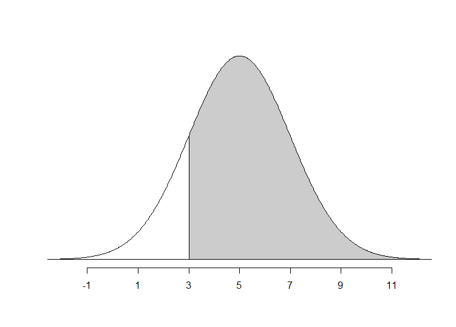

# Inference for a Single Categorical Variable: Theory-based Methods + Errors and Power

## Module 7 Reading Guide: Categorical Inference

### Chapter 11 (Inference with mathematical models) {-}

\setstretch{1}

**Videos**  

* Chapter11

\setstretch{1.25}

#### Reminders from previous sections {-}

$n_1$= sample size of group 1

$n_2$ = sample size of group 2

$\overline{x}$ = sample mean

$s$ = sample standard deviation

$\mu$ = population mean

$\sigma$ = population standard deviation

General steps of a hypothesis test:

1. Frame the research question in terms of hypotheses.

2. Collect and summarize data using a test statistic.
	
3. Assume the null hypothesis is true, and simulate or mathematically model a null distribution for the test statistic.

4. Compare the observed test statistic to the null distribution to calculate a p-value.

5. Make a conclusion based on the p-value and write the conclusion in context.

Parameter: a value summarizing a variable(s) for a population.

Statistic: a value summarizing a variable(s) for a sample.

Hypothesis test: a process to determine how strong the evidence of an effect is. Also called a ‘significance test’.

Simulation-based method: Simulate lots of samples of size $n$ under assumption of the null hypothesis, then find the proportion of the simulations that are at least as extreme as the observed sample statistic.

Theory-based method: Develop a mathematical model for the sampling distribution of the statistic under the null hypothesis and use the model to calculate the probability of the observed sample statistic (or one more extreme) occurring.

Null hypothesis ($H_0$): the skeptical perspective; no difference; no change; no effect; random chance; what the researcher hopes to prove is **wrong**.

Alternative hypothesis ($H_A$): the new perspective; a difference/increase/decrease; an effect; not random chance; what the researcher hopes to prove is **correct**.

Null value: the value of the parameter when we assume the null hypothesis is true (labeled as $parameter_0$).

P-value: probability of seeing the observed sample data, or something more extreme, assuming the null hypothesis is true.

$\implies$ Lower the p-value the stronger the evidence AGAINST the null hypothesis and FOR the alternative hypothesis.

Significance level ($\alpha$): a threshold used to determine if a p-value provides enough evidence to reject the null hypothesis or not.

\rgi Common levels of $\alpha$ include 0.01, 0.05, and 0.10.

Statistically significant: results are considered statistically significant if the p-value is below the significance level.

Confidence interval: a process to determine how large an effect is; a range of plausible values for the parameter. Also called 'estimation'.

#### Vocabulary {-}

Central Limit Theorem:
\rgs

Sampling distribution:
\rgs

Normal distribution (Also known as: normal curve, normal model, Gaussian distribution): 
\rgs

\rgi Notation:
\rgs

Standard normal distribution: 
\rgs

\rgi Notation:
\rgs

Z-score:
\rgs

$X$th percentile: 
\rgs

68-95-99.7 rule: 
\rgs

Standard error of a statistic:
\rgs

Standard deviation of a statistic:
\rgs

Margin of error:
\rgs

#### Notes {-}

The two general conditions for the sampling distribution for a sample proportion (or difference in sample proportions) to be approximately normally distributed are:

\rgi 1)
\rgs

\rgi 2)
\rgs


Interpretation of a Z-score: 
\rgs

True or False: The more unusual observation will be the observation with the largest Z-score.
	
Approximately what percent of a normal distribution is in the interval

\rgi (mean – standard deviation, mean + standard deviation):
\rgs
 
\rgi (mean – 2$\times$(standard deviation), mean + 2$\times$(standard deviation)):
\rgs

\rgi (mean – 3$\times$(standard deviation), mean + 3$\times$(standard deviation)):
\rgs

Given a mean and standard deviation, what function in R would help us find the percent of the normal distribution above (or below) a specific value?
\rgs

Given a mean and standard deviation, what function in R would help us find the value at a given percentile?
\rgs

How is the standard deviation of a statistic ($SD(statistic)$) different from the standard error of a statistic ($SE(statistic)$)?
\rgs

How is the standard deviation of a statistic ($SD(statistic)$) different from the standard deviation of a sample ($s$)?
\rgs

#### Formulas {-}

Z =
\rgs

$SD(\hat{p})$ = 
\rgs

General form of a theory-based confidence interval =
\rgs

General form for margin of error = 
\rgs

### R coding {-}

##### Calculating normal probabilities {-}

When using the `pnorm()` R function, you will need to enter values for the arguments `mean`, `sd`, and `q` to match the question.

```{r, echo=TRUE, eval=FALSE}
pnorm(mean = mu, sd = sigma, q = x, lower.tail = TRUE)
```

This function will return the proportion of the N(`mu`,`sigma`) distribution which is *below* the value `x`.

Example: `pnorm(mean = 5, sd = 2, q = 3, lower.tail = TRUE)` will give us the proportion of a N(5,2) distribution which is below 3, which equals 0.159:
 
```{r, echo=TRUE, eval=TRUE}
pnorm(mean = 5, sd = 2, q = 3, lower.tail = TRUE)
```

Changing to `lower.tail = FALSE` will give the proportion of the distribution which is *above* the value `x`.

```{r, echo=TRUE, eval=TRUE}
pnorm(mean = 5, sd = 2, q = 3, lower.tail = FALSE)
```

##### Displaying normal probabilities {-} 

When using the `normTail()` R function, you will need to enter values for the arguments `m`, `s`, and `L` (or `U`) to match the question.

```{r, echo=TRUE, eval=FALSE}
normTail(m = mu, s = sigma, L = x)
```

This function (in the `openintro` package) will plot a N(`mu`, `sigma`) distribution and shade the area that is below the value `x`.

Example: `normTail(m = 5, s = 2, L = 3)` creates the plot pictured below.

```{r normgt3, fig.cap="", out.width="60%", echo=FALSE}
#
normTail(m = 5, s = 2, L = 3)
```

Changing `L` to `U` will shade the area *above* `x`.  

Example: `normTail(m = 5, s = 2, U = 3)` plots a N(5,2) distribution with the area above 3 shaded.

##### Calculating normal percentiles {-}

When using the `qnorm()` R function, you will need to enter values for the arguments `mean`, `sd`, and `p` to match the question.

```{r, echo=TRUE, eval=FALSE}
qnorm(mean = mu, sd = sigma, p = x, lower.tail = TRUE)
```

This function will return the value on the N(`mu`, `sigma`) distribution which has `x` area of the distribution *below* it.

Example:  `qnorm(mean = 5, sd = 2, p = 0.159, lower.tail = TRUE)` will give us the value on a N(5,2) distribution which has 0.159 (15.9%) of the distribution below it, which equals 3 (from the R output above).

Changing to `lower.tail = FALSE` will give the value which has `x` area of the distribution *above* it.

We would recommend you work through each of the examples in Section 5.2.4 using R.


### Section 14.3 (Theory-based inferential methods for $\pi$) {-}

\setstretch{1}

**Videos**  

* 14.3TheoryTests
* 14.3TheoryIntervals

\setstretch{1.25}

#### Vocabulary {-}

#### Reminders from previous sections {-}

$n$ = sample size

$\hat{p}$ = sample proportion

$\pi$ = population proportion

General steps of a hypothesis test:

1. Frame the research question in terms of hypotheses.

2. Collect and summarize data using a test statistic.
	
3. Assume the null hypothesis is true, and simulate or mathematically model a null distribution for the test statistic.

4. Compare the observed test statistic to the null distribution to calculate a p-value.

5. Make a conclusion based on the p-value and write the conclusion in context.

Parameter: a value summarizing a variable(s) for a population.

Statistic: a value summarizing a variable(s) for a sample.

Sampling distribution: plot of statistics from 1000s of samples of the same size taken from the same population.

Standard deviation of a statistic: the variability of statistics from 1000s of samples; how far, on average, each statistic is from the true value of the parameter.

Standard error of a statistic: estimated standard deviation of a statistic.

Hypothesis test: a process to determine how strong the evidence of an effect is.
		
\rgi Also called a ‘significance test’.

Theory-based method: Develop a mathematical model for the sampling distribution of the statistic under the null hypothesis and use the model to calculate the probability of the observed sample statistic (or one more extreme) occurring.

Null hypothesis ($H_0$): the skeptical perspective; no difference; no change; no effect; random chance; what the researcher hopes to prove is **wrong**.

Alternative hypothesis ($H_A$): the new perspective; a difference/increase/decrease; an effect; not random chance; what the researcher hopes to prove is **correct**.

P-value: probability of seeing the observed sample data, or something more extreme, assuming the null hypothesis is true.

$\implies$ Lower the p-value the stronger the evidence AGAINST the null hypothesis and FOR the alternative hypothesis.

Decision: a determination of whether to 'reject' or 'fail to reject' a null hypothesis based on a p-value and a pre-set level of significance.

Significance level ($\alpha$): a threshold used to determine if a p-value provides enough evidence to reject the null hypothesis or not.

\rgi Common levels of $\alpha$ include 0.01, 0.05, and 0.10.

Statistically significant: results are considered statistically significant if the p-value is below the significance level.

Central Limit Theorem: For large sample sizes, the sampling distribution of a sample proportion (or mean) will be approximately normal (bell-shaped and symmetric).

Confidence interval: a process to determine how large an effect is; a range of plausible values for the parameter; also called 'estimation'.

Margin of error: the value that is added to and subtracted from the sample statistic to create a confidence interval; half the width of a confidence interval.

#### Vocabulary {-}

Null standard error:
\rgs

Standardized statistic:
\rgs

Confidence level: 
\rgs

		
#### Notes {-}

Conditions for the Central Limit Theorem to apply (for the sampling distribution of $\hat{p}$ to be approximately normal)

\rgi Independence: 
\rgs

\rgi \rgi Checked by: 
\rgs

\rgi Success-failure condition: 
\rgs

\rgi \rgi Checked by: 
\rgs

How can we determine the value of $z^⋆$ to use as the multiplier in a confidence interval?
\rgs

\rgi In R, use `qnorm(mean = __, sd = __, p = __)`.

Select one answer in each set of parentheses: The higher the confidence level, the (larger/smaller) the multiplier, meaning the confidence interval will be (wider/narrower).

If the success-failure condition for the Central Limit Theorem is not met, what is the appropriate method of analysis?  Select one:
\rgi A. Theory-based approach
\rgi B. Simulation based approach.


#### Formulas {-}

$SD(\hat{p})$ =
\rgs

Null standard error of the sample proportion:

$SE_0(\hat{p})$ = 
\rgs
	
Standardized statistic (in this case, standardized sample proportion):

$Z$ =
\rgs
	

Standard error of the sample proportion when we do not assume the null hypothesis is true:

$SE(\hat{p})$ = 
\rgs
	
Theory-based confidence interval for a sample proportion: 
\rgs

Margin of error of a confidence interval for a sample proportion: 
\rgs


#### Example: Payday loans {-}

1. What is the parameter representing in the context of this problem?  What notation would be used to represent this parameter?
\rgs
\rgs

3. Write the null and alternative hypotheses in words.
\rgs
\rgs

4. Write the null and alternative hypotheses in notation.
\rgs
	
4. Are the conditions met to use theoretical methods to analyze these data?  Show your calculations to justify your answer.
\rgs
\rgs

5. Calculate the null standard error of the sample proportion.
\rgs
\rgs

6. What is the sample statistic presented in this example?  What notation would be used to represent this value?
\rgs

7. Calculate the standardized sample proportion (standardized statistic).
\rgs
\rgs

8. How can we calculate a p-value from the normal distribution for this example?
\rgs
\rgs

9. What was the p-value of the test? 
\rgs
	

10. What conclusion should the researcher make?
\rgs
\rgs

11. Are the results in this example statistically significant?  Justify your answer.
\rgs

12. Calculate the standard error of the sample proportion when we do not assume the null hypothesis is true.
\rgs
\rgs

13. Calculate the margin of error for a 95\% confidence interval for $\pi$ using 1.96 as the multiplier.
\rgs
\rgs

14. Calculate a 95\% confidence interval for $\pi$ using your margin of error calculated above.
\rgs
\rgs

15. Interpret the 95\% confidence interval provided in the textbook.
\rgs
\rgs

16. Does the 95% confidence interval support the same conclusion as the p-value from the hypothesis test?  Justify your answer.
\rgs


### Chapter 12 (Errors, power, and practical importance) {-}

\setstretch{1}

**Videos**  

* Chapter12

\setstretch{1.25}

#### Reminders from previous sections {-}

Significance level ($\alpha$): a threshold used to determine if a p-value provides enough evidence to reject the null hypothesis or not.

\rgi Common levels of $\alpha$ include 0.01, 0.05, and 0.10.

Statistically significant: results are considered statistically significant if the p-value is below the significance level.

#### Vocabulary {-}

Decision:

\rgs
* If the p-value is small (less than or equal to the significance level), the decision will be to __________ the null hypothesis.

* If the p-value is large (greater than the significance level), the decision will be to __________ the null hypothesis.

Type 1 error: 
\rgs

Type 2 error: 
\rgs

Confirmation bias: 
\rgs

One-sided hypothesis tests:
\rgs

Two-sided hypothesis tests:
\rgs

Power: 
\rgs
		
Practical importance: 
\rgs

#### Notes {-}

Fill in the following table with whether the decision was correct or not, and if not, what type of error was made.
\begin{center}
\begin{tabular}{|p{2in}|p{2in}|p{2in}|}
\hline
 & \multicolumn{2}{|c|}{\textbf{Test conclusion (based on data)}} \\ \hline
 \textbf{Truth (unknown)} & Reject null hyp. & Fail to reject null hyp. \\ \hline
 $H_0$ is true && \\ 
   & & \\ 
   & & \\ \hline
 $H_A$ is true ($H_0$ is false)  && \\ 
   & & \\ 
   & & \\ \hline
\end{tabular}
\end{center}

\rgs

How are the significance level and type I error rate related?
\rgs

How are the significance level and type II error rate related?
\rgs

Explain the differences between a one-sided and two-sided hypothesis test.
\vspace{1mm}

\rgi How will the research questions differ?
\rgs

\rgi How will the notation in the alternative hypothesis differ?
\rgs

\rgi How does the p-value calculation differ?
\rgs

How does the p-value in a two-sided test compare to the p-value in a one-sided test?
\rgs

Should the default in research be a one-sided or two-sided hypothesis test?  Explain why.
\rgs
\rgs

After collecting data, a researcher decides to change from a two-sided test to a one-sided test.  Why is this a bad idea?

1. It ____________ (increases/decreases) the chance of a type I error.

2. This can result in ________________________.
\rgs

How are power and type I error rate related?
\rgs

How are power and type II error rate related?
\rgs

How can we increase the power of a test?

1. ________ (Increase/Decrease) the significance level
\rgs

2. ________ (Increase/Decrease) the sample size
\rgs

3. Change from a ___ (one/two)-sided to a ___ (one/two)-sided test
\rgs

4. Have a ________ (larger/smaller) standard deviation of the statistic
\rgs

5. Have the alternative parameter value _______ (closer/farther) from the null value
\rgs

Results are likely to be statistically significant (but may not be practically important) if the sample size is __________(large/small).
\rgs

Results are unlikely to be statistically significant (but may be practically important) if the sample size is __________(large/small).
\rgs

#### Examples: {-} 

1. In the Martian Alphabet study section 9.1 of the textbook,

\rgi a. What was the p-value of the test?
\rgs

\rgi b.	At the 5% significance level, what decision would you make?
\rgs

\rgi c. What type of error might have occurred in these data?
\rgs

\rgi d. Interpret that error in the context of the problem.
\rgs
\rgs

2. In the Medical Consultant study in section 10.1 of the textbook,

\rgi a. What was the p-value of the test?
\rgs

\rgi b. At the 5% significance level, what decision would you make?
\rgs

\rgi c. What type of error might have occurred in these data?
\rgs

\rgi d. Interpret that error in the context of the problem.
\rgs
\rgs

3. In the Payday Loans study section 14.3 of the textbook,

\rgi a. What was the p-value of the test?
\rgs

\rgi b. At the 5% significance level, what decision would you make?
\rgs

\rgi c. What type of error might have occurred in these data?
\rgs

\rgi d. Interpret that error in the context of the problem.
\rgs

\newpage